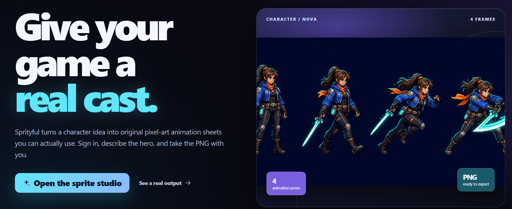
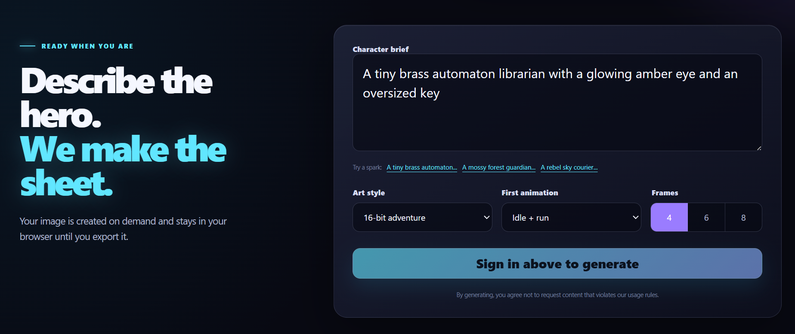
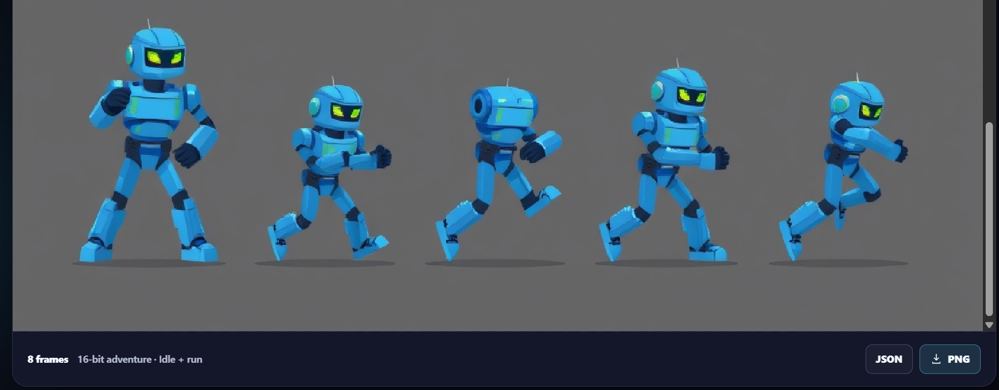

# Sprityful

<p align="center">
  
</p>

<p align="center">
  Turn a character idea into an original, downloadable game sprite sheet.
</p>

<p align="center">
  <a href="https://sprityful.vercel.app/"><strong>Open Sprityful</strong></a>
  &nbsp;&middot;&nbsp;
  <a href="https://github.com/YamCham0/Sprityful/issues">Report an issue</a>
</p>



## Make sprites in a few steps

1. [Open the sprite studio](https://sprityful.vercel.app/studio) and sign in with email/password or Google.
2. Describe your character, then pick an art style, first animation, and frame count.
3. Generate an original sprite sheet.
4. Download a transparent PNG and optional starter JSON metadata for your game.

Every verified account receives **1 generation per UTC day**. This keeps the free generation pool available for everyone.

## What the studio looks like

| Studio controls | Generated sprite sheet |
| --- | --- |
|  |  |

### Export your work



## Run Sprityful locally

You need Node.js 20 or newer, a Cloudflare Workers AI account, and a Supabase project.

```bash
git clone https://github.com/YamCham0/Sprityful.git
cd Sprityful
npm install
cp .env.example .env.local
npm run dev
```

On Windows PowerShell, use this instead of `cp`:

```powershell
Copy-Item .env.example .env.local
```

Then open [http://localhost:3000](http://localhost:3000). Before generation and sign-in work, fill in `.env.local` as described below.

## Connect your services

### 1. Cloudflare Workers AI

Create a Cloudflare API token with **Workers AI Read** and **Workers AI Edit** permissions, then add these values to `.env.local`:

```env
CLOUDFLARE_ACCOUNT_ID=your_cloudflare_account_id
CLOUDFLARE_API_TOKEN=your_workers_ai_api_token
```

### 2. Supabase authentication and daily quota

1. Run the SQL files in [`supabase/migrations`](supabase/migrations) in filename order.
2. Add your local callback (`http://localhost:3000/auth/callback`) and production callback (`https://sprityful.vercel.app/auth/callback`) in **Authentication -> URL Configuration**.
3. Keep email confirmation enabled if you want every email/password account to verify its address.
4. Enable the Google provider in Supabase if you want Google sign-in. Add the Supabase callback URL to your Google OAuth client, then paste the client ID and secret back into Supabase.

Add these Supabase values to `.env.local`:

```env
NEXT_PUBLIC_SUPABASE_URL=https://your-project-ref.supabase.co
NEXT_PUBLIC_SUPABASE_PUBLISHABLE_KEY=your_supabase_publishable_key
SUPABASE_SECRET_KEY=your_supabase_secret_key
```

`SUPABASE_SECRET_KEY`, `CLOUDFLARE_API_TOKEN`, and `CLOUDFLARE_ACCOUNT_ID` are server-only. Never give them a `NEXT_PUBLIC_` prefix or commit them to Git.

## Deploy to Vercel

1. Import this GitHub repository into Vercel.
2. Add every value from `.env.example` to **Production**, **Preview**, and **Development**.
3. Deploy. Future pushes to `main` will automatically create a new production deployment.

## Optional: fund Sprityful with Google AdSense

The site is ready for a single, clearly labelled manual ad slot on the public landing page. The sprite studio, sign-in flow, generator, and export buttons stay ad-free.

1. Apply at [Google AdSense](https://www.google.com/adsense/), add `sprityful.vercel.app` as the site, and add the publisher client ID below to Vercel. Deploy so Google can verify the site.
2. In AdSense, create a **manual responsive display ad unit** for the landing page. Leave Auto ads off so ads never appear inside the studio.
3. In **Privacy & messaging**, publish Google&apos;s European regulations consent message for `https://sprityful.vercel.app` and set its privacy-policy URL to `https://sprityful.vercel.app/privacy`.
4. After approval, add the ad unit slot and change `NEXT_PUBLIC_ADSENSE_ENABLE_ADS` to `true`, then deploy again.

```env
NEXT_PUBLIC_ADSENSE_CLIENT=ca-pub-1234567890123456
NEXT_PUBLIC_ADSENSE_LANDING_SLOT=1234567890
NEXT_PUBLIC_ADSENSE_ENABLE_ADS=true
ADSENSE_PUBLISHER_ID=pub-1234567890123456
```

`ads.txt` is served automatically at `https://sprityful.vercel.app/ads.txt` once the publisher ID is configured. The AdSense client ID and ad-unit slot are public identifiers; do not put any payment, API, or login secret in these variables.

## How it works

- Sprityful uses Cloudflare Workers AI (`@cf/black-forest-labs/flux-1-schnell`) to create the sprite-sheet source.
- The generator requests a green chroma-key background; Sprityful removes it in the browser when you download the final PNG.
- Supabase handles email/password and Google sign-in.
- A transaction-safe Supabase function reserves a generation before image creation, enforcing the one-per-day limit even when requests happen at the same time.
- Images are returned to the browser for export; Sprityful does not create a public gallery of user generations.

## Helpful notes

- Avoid bright green clothing or props: green is used as the export background key.
- The generated image starts as JPEG because of the model output; use the **PNG** button for a transparent export.
- Visitors can browse the site, but generation requires a non-anonymous Supabase account.
